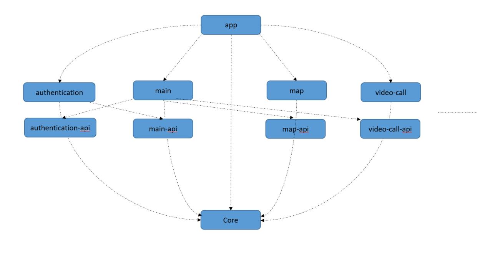

# Rakuten-Android

Rakuten Android app

## Environment

- Android 6.0~ (API 23+)
- Kotlin

## Code formating

- Using Ktlint

## Testing

- Write unit tests for ViewModels.
- Using Mockk, JUnitTest ...

## Architecture

MVI Clean Architecture

## Multimodule

